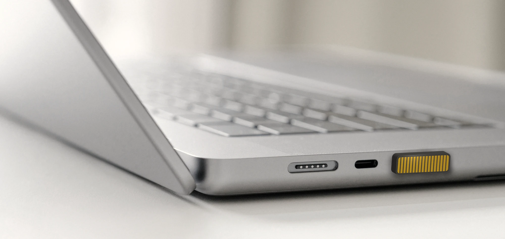

# SoundSlide Open Source

Welcome to the **SoundSlide** open-source repository!

Here, we’re sharing a subset of the SoundSlide project, focused on providing developers, hardware enthusiasts, and the open-source community with the resources needed to understand, customize, and contribute to this project.



SoundSlide is a compact, touch-sensitive USB device designed for intuitive audio control on laptops. This repository includes the core elements that power SoundSlide and makes it easy for anyone to dive into its functionality.

## Contents

This repository includes the following components:

1. **Command Line Interface** ([cli](cli)):
   A tool for configuring and interacting with SoundSlide from the command line. Use it to set parameters, check device status, and update firmware. The CLI offers flexibility for advanced users and developers.

2. **Schematics** ([schematics.pdf](schematics.pdf))
   The electrical schematics of SoundSlide, providing an overview of the hardware design. This allows anyone interested to understand the circuit layout, components, and connectivity.

3. **Firmware Source Code** ([fw](fw))
   The core firmware that controls SoundSlide’s functionality. Written primarily in C, the firmware handles USB communication, touch-sensitive inputs, and command responses. Contributions to enhance or expand functionality are welcome.

## Getting Started

Clone the repository and explore each component:

```bash
git clone https://github.com/soundslide/open.git soundslide
cd soundslide
```

Each component has its own subdirectory with specific instructions for building, configuring, or customizing.

## Contributing

We welcome contributions to improve the CLI, schematics, and firmware. Please submit a pull request with a brief description of your changes, and our team will review it. For any questions, feel free to reach out via GitHub Issues.

## License

This project is released under the [MIT License](LICENSE), allowing for flexible usage and modifications within the open-source community.

## About SoundSlide

SoundSlide is designed and developed by **Drake Labs**. Our goal is to make intuitive, user-friendly devices that enhance everyday tech experiences. For more information about SoundSlide, visit our website at [soundslide.io](http://soundslide.io).
